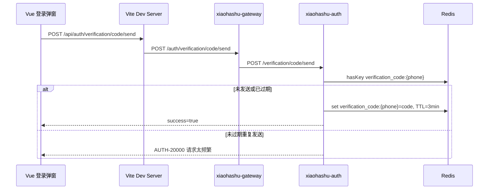

# 发送验证码功能实现说明

## 1. 功能范围

本项目的发送验证码功能用于手机号登录场景。当前代码已经实现：

- 前端登录弹窗中点击“获取验证码”。
- 通过 Vite 代理访问后端网关。
- 网关把 `/auth/**` 请求路由到 `xiaohashu-auth` 微服务。
- `xiaohashu-auth` 生成 6 位数字验证码。
- 验证码写入 Redis，并设置 3 分钟过期时间。
- 同一手机号在验证码未过期前再次发送会被拦截。

当前代码还没有真正接入第三方短信服务，发送动作目前是异步线程中打印日志，属于模拟发送。

## 2. 调用链路



## 3. 前端实现

前端代码在原始前端工程：

- `E:\CodeDir\xiaohashu_origin\xiaohashu-vue3\src\components\auth\LoginModal.vue`
- `E:\CodeDir\xiaohashu_origin\xiaohashu-vue3\src\api\auth.js`
- `E:\CodeDir\xiaohashu_origin\xiaohashu-vue3\src\axios.js`
- `E:\CodeDir\xiaohashu_origin\xiaohashu-vue3\vite.config.js`

登录弹窗中，手机号输入框会把用户输入格式化成 `xxx xxxx xxxx`，同时把真正提交给后端的手机号保存到 `phone`，即不带空格的 11 位手机号。

点击“获取验证码”时会先判断手机号是否合法：

```js
phone.value.length === 11 && /^1[3-9]\d{9}$/.test(phone.value)
```

合法后调用：

```js
getVerificationCode(phone.value)
```

接口定义：

```js
const API_PREFIX = '/auth'

export function getVerificationCode(phone) {
    return axios.post(`${API_PREFIX}/verification/code/send`, { phone })
}
```

Axios 的 `baseURL` 是 `/api`，所以浏览器里实际请求地址是：

```text
POST http://localhost:5173/api/auth/verification/code/send
```

Vite 代理会把 `/api` 去掉，再转发到网关：

```js
server: {
  proxy: {
    '/api': {
      target: 'http://localhost:8000',
      changeOrigin: true,
      rewrite: (path) => path.replace(/^\/api/, ''),
    },
  }
}
```

因此网关收到的真实路径是：

```text
POST /auth/verification/code/send
```

请求成功后，前端开始 180 秒倒计时；倒计时期间按钮禁用，避免用户连续点击。

## 4. 网关路由

网关配置文件：

`E:\CodeDir\xiaohashu\xiaohashu-gateway\src\main\resources\application.yml`

验证码接口走 auth 路由：

```yaml
- id: auth
  uri: lb://xiaohashu-auth
  predicates:
    - Path=/auth/**
  filters:
    - StripPrefix=1
```

`StripPrefix=1` 会移除第一个路径段 `/auth`。

所以：

```text
/auth/verification/code/send
```

会转发成：

```text
/verification/code/send
```

这正好匹配 auth 微服务里的控制器路径。

## 5. 后端接口

控制器文件：

`E:\CodeDir\xiaohashu\xiaohashu-auth\src\main\java\com\dyc\xiaohashu\auth\controller\VerificationCodeController.java`

核心结构：

```java
@RestController
@RequestMapping("/verification")
@RequiredArgsConstructor
public class VerificationCodeController {

    private final VerificationCodeService verificationCodeService;

    @PostMapping("/code/send")
    public Response<Void> sendCode(@RequestBody @Validated SendCodeReq request) {
        verificationCodeService.sendCode(request.getPhone());
        return Response.success();
    }
}
```

接口信息：

```text
POST /verification/code/send
Content-Type: application/json
```

请求体：

```json
{
  "phone": "19862172631"
}
```

经过网关访问时，外部路径是：

```text
POST /auth/verification/code/send
```

经过前端开发代理访问时，浏览器路径是：

```text
POST /api/auth/verification/code/send
```

## 6. 请求参数校验

DTO 文件：

`E:\CodeDir\xiaohashu\xiaohashu-auth\src\main\java\com\dyc\xiaohashu\auth\dto\SendCodeReq.java`

当前只校验手机号不能为空：

```java
@Data
public class SendCodeReq {

    @NotBlank(message = "手机号不能为空")
    private String phone;
}
```

手机号格式校验主要在前端完成。后端当前没有校验手机号是否满足 `^1[3-9]\d{9}$`，如果要做得更稳，后续可以在 DTO 上补 `@Pattern`。

## 7. 验证码生成与存储

服务文件：

`E:\CodeDir\xiaohashu\xiaohashu-auth\src\main\java\com\dyc\xiaohashu\auth\service\VerificationCodeServiceImpl.java`

核心配置：

```java
private static final long CODE_EXPIRE_MINUTES = 3;
private static final int CODE_LENGTH = 6;
```

发送流程：

1. 生成 6 位数字验证码。
2. 根据手机号构造 Redis key。
3. 查询 Redis 中是否已经存在该手机号的验证码。
4. 如果存在，说明验证码仍未过期，抛出 `VERIFICATION_CODE_SEND_FREQUENTLY`。
5. 如果不存在，提交异步任务模拟发送短信。
6. 把验证码写入 Redis，过期时间为 3 分钟。

Redis key 构造文件：

`E:\CodeDir\xiaohashu\xiaohashu-auth\src\main\java\com\dyc\xiaohashu\auth\constant\RedisKeyConstants.java`

```java
private static final String VERIFICATION_CODE_KEY_PREFIX = "verification_code:";

public static String buildVerificationCodeKey(String phone) {
    return VERIFICATION_CODE_KEY_PREFIX + phone;
}
```

Redis 数据示例：

```text
key:   verification_code:19862172631
value: 482915
TTL:   180s
```

## 8. 短信发送现状

当前没有真正调用阿里云、腾讯云等短信平台。代码中使用线程池异步模拟耗时发送：

```java
threadPoolTaskExecutor.submit(() -> {
    Thread.sleep(3000);
    log.info("验证码已生成，手机号: {}, 验证码: {}", phone, code);
});
```

也就是说，验证码真实值目前只能从 auth 服务日志里看到。后续接短信平台时，需要把这段日志模拟逻辑替换为真实短信 SDK 或 HTTP API 调用。

## 9. 验证码校验

`VerificationCodeService` 提供了校验方法：

```java
void verifyCode(String phone, String code);
```

实现逻辑：

1. 根据手机号构造 Redis key。
2. 从 Redis 读取验证码。
3. 如果读取不到，说明验证码不存在或已过期，抛出 `VERIFICATION_CODE_EXPIRED`。
4. 如果输入验证码和 Redis 中的验证码不一致，抛出 `VERIFICATION_CODE_ERROR`。
5. 如果校验成功，删除 Redis key，避免验证码重复使用。

登录接口的接入点在：

`E:\CodeDir\xiaohashu\xiaohashu-auth\src\main\java\com\dyc\xiaohashu\auth\service\AuthServiceImpl.java`

验证码登录分支会调用：

```java
verificationCodeService.verifyCode(phone, verificationCode);
```

这样发送验证码和登录校验都统一走 `VerificationCodeServiceImpl`，Redis key 构造和 Redis 读写模板保持一致。

## 10. Redis 配置

配置文件：

`E:\CodeDir\xiaohashu\xiaohashu-auth\src\main\resources\config\application-dev.yml`

当前 Redis 配置指向本机：

```yaml
spring:
  data:
    redis:
      database: 0
      host: 127.0.0.1
      port: 6379
      timeout: 5s
      connect-timeout: 5s
```

所以本地运行验证码功能前，需要保证：

- Redis 已启动。
- Redis 监听 `127.0.0.1:6379`。
- 如果 Redis 有密码，需要补充 `spring.data.redis.password`。
- auth 服务实际启动时加载了 `application-dev.yml` 或 Nacos 中等价的 Redis 配置。

## 11. 常见问题

### 11.1 点击“获取验证码”没反应

常见原因：

- 手机号没有通过前端校验，按钮处于 disabled 状态。
- Vite 代理目标不对，导致请求没有转发到网关。
- 网关 `xiaohashu-gateway` 没启动，或者端口不是 `8000`。
- 网关没有注册发现到 `xiaohashu-auth`。
- auth 服务没有启动。
- Redis 没启动，auth 服务写验证码时报 `RedisConnectionFailureException`。

### 11.2 Network 里请求是红色，Response headers 为 0

这通常说明请求没有拿到后端响应，常见于代理目标不可达。例如前端访问：

```text
http://localhost:5173/api/auth/verification/code/send
```

但 Vite 代理转发的网关地址不可达。当前应转发到：

```text
http://localhost:8000
```

修改 `vite.config.js` 后必须重启前端开发服务，否则代理配置不会生效。

### 11.3 返回 `AUTH-10000`

这是 auth 服务的系统异常兜底错误。之前本地日志里出现过：

```text
RedisConnectionFailureException: Unable to connect to Redis
Connection refused: /127.0.0.1:6379
```

说明请求已经到达 auth 服务，但 auth 服务连接不上 Redis。此时应先启动 Redis 或修改 Redis 连接配置。

### 11.4 输入正确验证码仍提示验证码错误

原因通常是发送验证码和登录校验使用了不同的 Redis 访问方式。例如发送验证码使用 `StringRedisTemplate` 写入：

```java
stringRedisTemplate.opsForValue().set(key, code, CODE_EXPIRE_MINUTES, TimeUnit.MINUTES);
```

登录校验如果使用普通 `RedisTemplate<String, Object>` 读取，默认 key/value 序列化方式可能和 `StringRedisTemplate` 不一致，导致用同一个字符串 key 也取不到验证码，最终把正确验证码判成错误。

当前修复方式是：登录时不再单独用 `RedisTemplate` 读取验证码，而是直接复用：

```java
verificationCodeService.verifyCode(phone, verificationCode);
```

## 12. 后续建议

- 后端 DTO 增加手机号格式校验。
- 给 `ThreadPoolConfig` 补 Spring 配置注解，确保 `taskExecutor` bean 能被扫描注册。
- 接入真实短信服务，并把验证码日志降级或移除，避免泄露验证码。
- 增加 IP、手机号维度的限流，避免短信接口被刷。
- 接入真实短信服务后，保留登录接口中调用 `verifyCode` 的统一校验方式。
